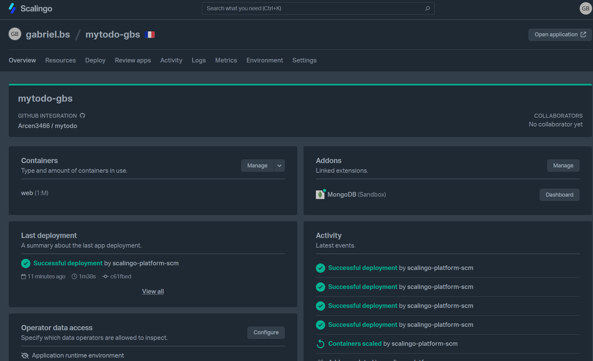
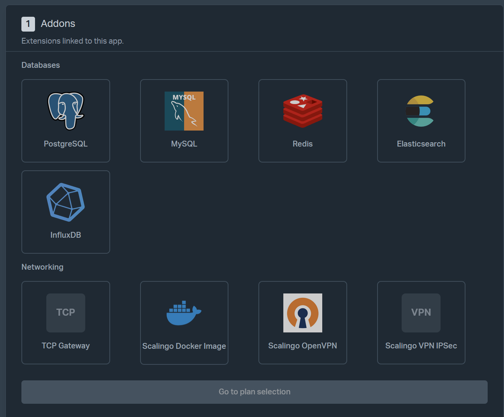
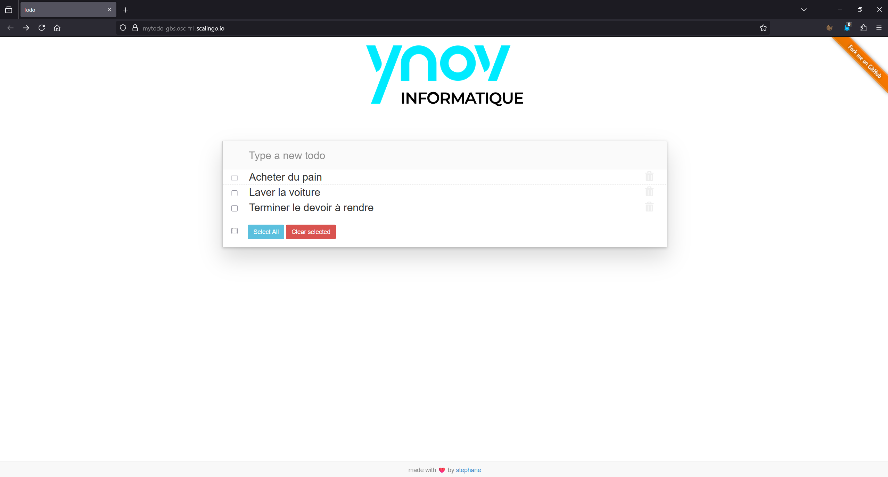

# MyTodo - Déploiement sur Scalingo avec MongoDB

Ce projet est une TodoList simple, forké depuis [https://github.com/smontri/mytodo](https://github.com/smontri/mytodo), et déployé sur la plateforme Scalingo avec une base de données MongoDB.

## Étapes de déploiement sur Scalingo

### 1. Fork du dépôt Git

Fork du repo fourni par le professeur :
> https://github.com/smontri/mytodo.git

### 2. Création de l'application sur Scalingo

- Se rendre sur [https://dashboard.scalingo.com/apps](https://dashboard.scalingo.com/apps)
- Créer une nouvelle app
- Lier le dépôt GitHub forké

 

---

### 3. Ajout de l’add-on MongoDB

- Aller dans l’onglet **"Add-ons"** de l’application Scalingo
- Ajouter l’add-on **MongoDB (Sandbox)**

 

Une fois l’add-on ajouté, Scalingo crée automatiquement une variable d’environnement :  
```SCALINGO_MONGO_URL```

### 4. Mise à jour du code
Fichier ```server.js```

Ajout de la détection de l’URL MongoDB :

```
let db;
if (process.env.CLOUDANT_USERNAME !== undefined)  {
  db = require('./lib/db-cloudant')(process.env);
} else if (process.env.SCALINGO_MONGO_URL !== undefined) {
  db = require('./lib/db-mongo')(process.env);
} else {
  db = require('./lib/in-memory')();
}
```
Fichier ```lib/db-mongo.js```

Utilisation directe de l’URL ```SCALINGO_MONGO_URL``` pour se connecter :
```
const uri = credentials.SCALINGO_MONGO_URL;

MongoClient.connect(uri, {
  useNewUrlParser: true,
  useUnifiedTopology: true
}, (err, client) => {
  if (err) return reject(err);
  db = client.db().collection(COLLECTION_NAME);
  resolve();
});
```
📸 [SCREEN DU CODE OU DE L’ENVIRONMENT VARIABLES]
### 5. Déploiement

Une fois les modifications faites :

Commit & push sur GitHub

Scalingo détecte les changements et redéploie automatiquement

 
### ✅ Résultat

 - L'application fonctionne avec MongoDB comme base de données persistante.
 - Les tâches sont conservées même après un redéploiement de l'app.

 